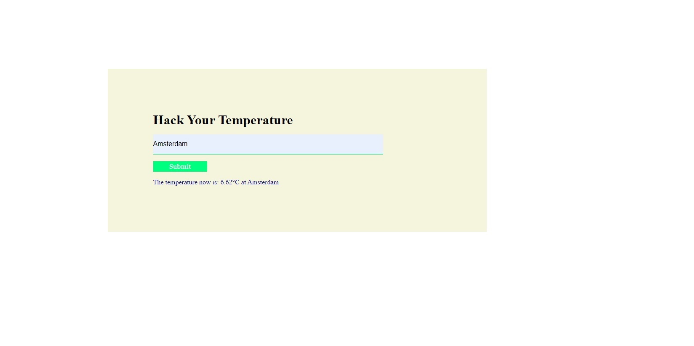

# Hack-Your-Temperature

CRUD application useing vanilla javascript,handlebars and expressjs

### [Live Site](https://ancient-atoll-19897.herokuapp.com/)

### Application

#### ES6 + Features

- Arrow Functions
- Template Literals
- Block-Scoped Variables Let and Const
- async await with try/catch
- Modules export/import

#### Libraries/Frameworks

- axios: to make HTTP requests
- nodejs: JS runtime for backend
- express: server/web framework for nodejs to create server
- express-handlebars:This view engine uses sensible defaults that leverage the
  "Express-way" of structuring an app's views. This makes it trivial to use in
  basic apps
- body-parser: middleware to allow reading the request from the client

### Getting Started

To get started you can simply clone the repo and install the dependencies in the
root folder

| Steps   | with [NPM](https://www.npmjs.com/) |
| ------- | ---------------------------------- |
| Install | `npm install`                      |
| Run     | `node start`                       |

Runs the app in the development mode.  Open
[http://localhost:3000](http://localhost:3000) to view it in the browser.
